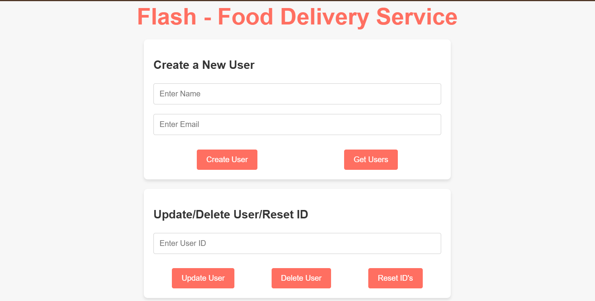

# Flash Delivery Service - User Management

## Description

The **Flash Delivery Service** project is a web application that allows managing users of a food delivery system. It provides functionalities for creating, updating, deleting users, as well as resetting user IDs in the database. The project is targeted at developers who need to interact with an API and a database for managing user data.

## Project Participants

- **Nikita Bobylev**

## Screenshot of the Main Page



## How to Run the Project

### Step 1: Open the terminal and navigate to the project directory.

Run the server with the following command:
```bash
go run main.go
```

### Step 2: Open the JustHTMLPage.html file in your browser.

You will be able to interact with the server by creating, updating, and deleting users.

### Step 3: Test the API
The API is available at http://localhost:8080 and supports the following endpoints:

- POST /api/users — create a new user.
- GET /api/users — retrieve a list of all users.
- PUT /api/users?id={id} — update user data by ID.
- DELETE /api/users?id={id} — delete a user by ID.
- POST /api/users/reset — reset user IDs.

## Tools and Resources Used

- Go — for implementing the server and handling requests.
- GORM — for interacting with the PostgreSQL database.
- PostgreSQL — the database for storing users.
- HTML, JavaScript — for creating the frontend.
- CORS — to allow cross-origin requests between the frontend and the server.

## Project Structure

- main.go — the main file implementing the server and request handling logic.
- JustHTMLPage.html — the HTML page for interacting with the server.
